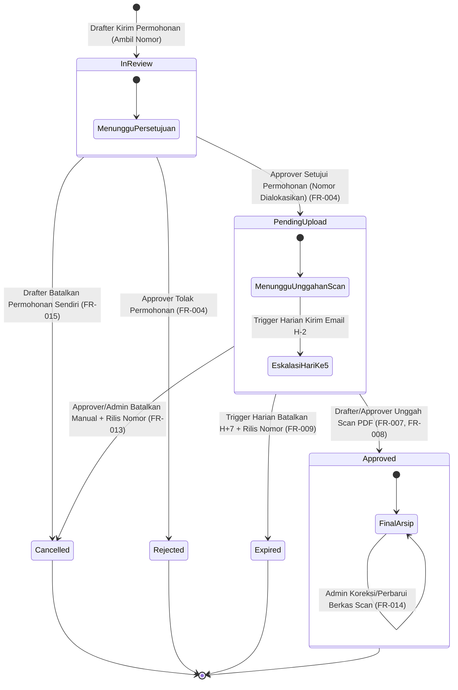

# Data Model Specification: Reservasi & Pengambilan Nomor Surat Eksternal (Ambil Nomor)

**Feature**: `specs/002-ambil-nomor-surat/spec.md`  
**Phase**: Phase 1 (Design & Contracts)  
**Date**: 2026-09-28  

Dokumen ini mendefinisikan perubahan model data Google Sheets (`AppDatabase`), struktur atribut entitas surat, status siklus hidup baru, dan diagram transisi status (*state machine*) untuk fitur Ambil Nomor Surat.

---

## 1. Pembaruan Skema Sheet `Letters`

Tabel `Letters` diperluas dengan kolom tambahan untuk mendukung naskah eksternal dan batas waktu rekonsiliasi.

| Kolom | Tipe | Contoh / Nilai Valid | Keterangan |
|---|---|---|---|
| `letterId` | String (PK) | `uuid-v4-string` | ID unik surat (dihasilkan via `Utils.generateUuid()`) |
| `letterNumber` | String | `0005.SP1/IX/2026` | Nomor resmi surat (`null` saat `In Review`, terisi setelah disetujui) |
| `documentType` | String | `INTERNAL` \| `EXTERNAL` | **[BARU]** Pembeda naskah: `INTERNAL` (surat biasa dengan Google Docs) atau `EXTERNAL` (Ambil Nomor naskah fisik) |
| `templateType` | String | `Surat Tugas` | Nama jenis kategori naskah dinas |
| `templateCode` | String | `ST`, `SP1` | Kode template untuk perakitan nomor resmi |
| `googleDocTemplateId` | String (Opsional) | `""` | Kosong untuk surat bertipe `EXTERNAL` |
| `contentData` | String (JSON) | *Lihat spesifikasi di bawah* | Metadata pokok surat (disanitasi dari formula injection) |
| `status` | String | `In Review` \| `Pending Upload` \| `Approved` \| `Rejected` \| `Expired` \| `Cancelled` | **[DIPERLUAS]** Status siklus hidup surat saat ini |
| `drafterEmail` | String (FK) | `drafter@gmail.com` | Email pemohon nomor surat |
| `approvalFlow` | String (JSON Array) | *Array 1 Approver* | Tahap otorisasi pejabat berwenang |
| `reconciliationDeadline` | DateTime (ISO) | `2026-10-05T08:00:00.000Z` | **[BARU]** Batas waktu 7 hari kalender (168 jam) sejak nomor disetujui |
| `escalationSentAt` | DateTime (ISO) | `2026-10-03T06:00:00.000Z` \| `null` | **[BARU]** Waktu pengiriman email peringatan hari ke-5 (H-2) |
| `cancellationReason` | String (Opsional) | `"Kegiatan dibatalkan oleh sponsor"` | **[BARU]** Catatan alasan jika surat dibatalkan atau kedaluwarsa |
| `finalPdfUrl` | String (Opsional) | `https://drive.google.com/...` | URL berkas PDF scan final yang telah diunggah dan disahkan |
| `finalFileName` | String (Opsional) | `0005.SP1-IX-2026 - Scan Final.pdf` | Nama berkas PDF final tersanitasi di Google Drive |
| `createdAt` | DateTime (ISO) | `2026-09-28T08:00:00.000Z` | Waktu pengajuan permohonan |
| `updatedAt` | DateTime (ISO) | `2026-09-28T08:30:00.000Z` | Waktu pembaruan status terakhir |

---

## 2. Struktur Data JSON `contentData` (Naskah Eksternal)

Untuk surat bertipe `EXTERNAL`, struktur `contentData` berisi metadata pokok yang dikirimkan pemohon:

```json
{
  "perihal": "Undangan Sosialisasi Program Kemitraan Wilayah",
  "tujuan": "Kepala Dinas Pendidikan Provinsi Jawa Barat",
  "tanggalSurat": "2026-09-28"
}
```

- Kolom `tanggalSurat` dikunci otomatis ke tanggal hari pengajuan berjalan (format `YYYY-MM-DD`) tanpa mengizinkan tanggal mundur (*no backdating*).
- Seluruh nilai teks disanitasi terhadap bahaya formula injection (`'`, `=`, `+`, `-`, `@`) oleh `Utils.sanitizeForSheets()`.

---

## 3. Struktur Data JSON `approvalFlow` (Naskah Eksternal)

Sesuai spesifikasi, permohonan nomor eksternal menerapkan alur otorisasi 1-tahap (tanpa reviewer berjenjang):

```json
[
  {
    "order": 1,
    "email": "kepala.bagian@gmail.com",
    "name": "Budi Santoso",
    "role": "approver",
    "status": "pending",
    "decisionAt": null,
    "notes": ""
  }
]
```

---

## 4. Diagram Transisi Status (*State Machine*)



---

## 5. Ringkasan Aksi Audit Log (`ApprovalLog`)

Sheet `ApprovalLog` mencatat setiap aksi mutasi pada siklus Ambil Nomor:

| `action` | Aktor | Status Awal | Status Akhir | Keterangan |
|---|---|---|---|---|
| `SUBMIT_TAKE_NUMBER` | Drafter | `-` | `In Review` | Drafter mengajukan permohonan nomor baru |
| `APPROVE_TAKE_NUMBER` | Approver | `In Review` | `Pending Upload` | Approver menyetujui, nomor dialokasikan atomik |
| `REJECT_TAKE_NUMBER` | Approver | `In Review` | `Rejected` | Approver menolak, nomor tidak pernah dialokasikan |
| `CANCEL_TAKE_NUMBER_DRAFTER` | Drafter | `In Review` | `Cancelled` | Drafter menarik permohonan sebelum diproses |
| `CANCEL_TAKE_NUMBER_MANUAL` | Approver/Admin | `Pending Upload` | `Cancelled` | Pembatalan manual, nomor dirilis ke daur ulang |
| `AUTO_EXPIRE_TAKE_NUMBER` | System (Trigger) | `Pending Upload` | `Expired` | Kedaluwarsa H+7, nomor dirilis ke daur ulang |
| `ESCALATE_TAKE_NUMBER_DAY5` | System (Trigger) | `Pending Upload` | `Pending Upload` | Pengiriman email pengingat eskalasi H-2 |
| `UPLOAD_FINAL_SCAN` | Drafter/Approver | `Pending Upload` | `Approved` | Pengunggahan scan resmi, dokumen sah final |
| `REPLACE_FINAL_SCAN_ADMIN` | Admin | `Approved` | `Approved` | Admin mengganti berkas scan dengan catatan revisi |
