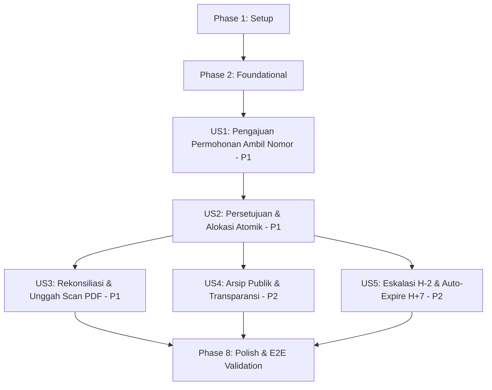

# Tasks: Reservasi & Pengambilan Nomor Surat Eksternal (Ambil Nomor)

**Feature**: [spec.md](spec.md)  
**Plan**: [plan.md](plan.md)  
**Status**: Ready for Implementation  

Daftar tugas implementasi terstruktur berdasarkan user story (prioritas P1 → P2) dengan pemetaan dependensi, peluang eksekusi paralel, dan kriteria pengujian mandiri.

---

## Phase 1: Setup (Shared Infrastructure & Constants)

**Purpose**: Inisialisasi konstanta global, enum status/tipe naskah baru, helper kalkulasi waktu rekonsiliasi, dan scaffolding test harness.

- [x] T001 Update enum constants in `Constants.gs`: define `DOCUMENT_TYPE = { INTERNAL: 'INTERNAL', EXTERNAL: 'EXTERNAL' }`, add status enum values `PENDING_UPLOAD: 'Pending Upload'`, `EXPIRED: 'Expired'`, `CANCELLED: 'Cancelled'`, and register audit log action types (`SUBMIT_TAKE_NUMBER`, `APPROVE_TAKE_NUMBER`, `REJECT_TAKE_NUMBER`, `CANCEL_TAKE_NUMBER_DRAFTER`, `CANCEL_TAKE_NUMBER_MANUAL`, `AUTO_EXPIRE_TAKE_NUMBER`, `ESCALATE_TAKE_NUMBER_DAY5`, `UPLOAD_FINAL_SCAN`, `REPLACE_FINAL_SCAN_ADMIN`)
- [x] T002 [P] Implement date, reconciliation, and letter number parsing helper utilities in `Utils.gs`: add `calculateCalendarDaysDiff(fromDate, toDate)`, `addCalendarDaysIso(isoDate, days)`, strict current date validator `isTodayDate(dateString)` enforcing `YYYY-MM-DD` matching system current date, and `parseLetterNumberParts(letterNumber)` to extract sequence integer, templateCode, roman month, and year for recycled pool returns
- [x] T003 [P] Setup test suite harness scaffolding and assertion helpers for external reservations in `take-number.test.gs`

---

## Phase 2: Foundational (Blocking Prerequisites)

**Purpose**: Ekstensi skema lembar data Google Sheets `Letters` dan `Counters` yang menjadi prasyarat seluruh user story.

**⚠️ CRITICAL**: Pengerjaan user story tidak dapat dimulai sebelum fase fondasi ini selesai.

- [x] T004 Extend `letter.repository.gs` to support new sheet columns in `Letters`: `documentType` (`'INTERNAL'` | `'EXTERNAL'`), `reconciliationDeadline` (ISO 8601 string / null), `escalationSentAt` (ISO 8601 string / null), `cancellationReason` (string / null), and `finalFileName` (string / null), ensuring formula injection escaping (`=`, `+`, `-`, `@`)
- [x] T005 [P] Extend `counter.repository.gs` to support cross-month recycling: implement `releaseNumberToRecycledPool(templateCode, sequenceNumber, month, year)` ensuring released sequence numbers are returned to their original allocation period counter `{templateCode}_{month}_{year}`
- [x] T006 [P] Extend audit logging repository in `sheet.repository.gs` to record Ambil Nomor lifecycle transitions with immutable fields (`logId`, `letterId`, `actorEmail`, `action`, `notes`, `timestamp`)

**Checkpoint**: Fondasi skema data dan repositori siap — implementasi User Story dapat dimulai.

---

## Phase 3: User Story 1 - Pengajuan Permohonan Nomor Surat Eksternal (Priority: P1) 🎯 MVP

**Goal**: Drafter dapat mengajukan permohonan nomor surat eksternal dengan metadata minimal (Perihal, Tujuan, Tanggal Surat dikunci ke tanggal hari ini, Kode Template) dan menunjuk 1 Approver berbeda (*separation of duties*), tersimpan dengan status `In Review` tanpa membuat dokumen Google Docs di Drive. Drafter juga dapat membatalkan permohonannya sendiri selama masih `In Review`.

**Independent Test**: Drafter login, membuka form Ambil Nomor, memilih template ST, tanggal terkunci pada tanggal hari ini, memilih 1 Approver (bukan dirinya sendiri), dan mengirim permohonan. Permohonan tersimpan di sheet `Letters` dengan `documentType: 'EXTERNAL'`, status `In Review`, `letterNumber: null`, dan notifikasi email terkirim ke Approver. Pada pengujian terpisah, Drafter membatalkan permohonan saat masih `In Review`: status berubah menjadi `Cancelled` tanpa alokasi nomor.

### Tests for User Story 1 ⚠️
- [x] T007 [P] [US1] Create automated unit tests for User Story 1 in `take-number.test.gs` verifying valid metadata submission, strict today's date validation (rejecting backdating/forward dating), separation of duties (rejecting self as approver), and Drafter self-cancellation while `In Review`

### Implementation for User Story 1
- [x] T008 [US1] Implement `submitTakeNumberRequest(payload)` in `letter.service.gs` validating required fields (`perihal`, `tujuan`, `tanggalSurat`, `templateCode`, `approver`), enforcing `documentType = 'EXTERNAL'`, sanitizing inputs via `Utils.sanitizeForSheets()`, verifying `approver.email !== currentUser.email`, setting initial status to `'In Review'`, and recording audit log `SUBMIT_TAKE_NUMBER`
- [x] T009 [US1] Implement Drafter self-cancellation `cancelTakeNumberByDrafter(letterId)` in `letter.service.gs` verifying `currentUser.email === letter.drafterEmail`, verifying status is `'In Review'`, updating status to `'Cancelled'` without modifying numbering counters, and recording audit log `CANCEL_TAKE_NUMBER_DRAFTER`
- [x] T010 [US1] Implement controller endpoints `submitTakeNumberRequest(payload)` and `cancelTakeNumberByDrafter(letterId)` in `letter.controller.gs` per `contracts/take-number-contract.md` with server-side authentication guards via `authService.getCurrentUser()`
- [x] T011 [US1] Implement email notification dispatching to Approver upon external request submission in `notification.service.gs` (`sendTakeNumberRequestNotification(letter, approver)`)
- [x] T012 [US1] Implement "Ambil Nomor Surat (Eksternal)" tab/form interface in `CreateLetter.html` with locked today's date (`YYYY-MM-DD`), template picker, single Approver select dropdown (excluding current user email), and client-side validation

**Checkpoint**: User Story 1 fungsional penuh dan dapat diuji secara mandiri (MVP Baseline).

---

## Phase 4: User Story 2 - Persetujuan & Penerbitan Atomik Nomor Surat (Priority: P1)

**Goal**: Approver meninjau permohonan nomor, dapat menyetujui (Approve) yang secara atomik menerbitkan nomor urut standar menggunakan antrean daur ulang (`recycledNumbers`) jika tersedia atau menaikkan urutan counter baru, menetapkan tenggat waktu rekonsiliasi 7 hari kalender (168 jam), dan mengubah status menjadi `Pending Upload`. Jika ditolak (Reject), alur berhenti dengan status `Rejected` dan alasan penolakan wajib tanpa alokasi nomor.

**Independent Test**: Approver membuka permohonan berstatus `In Review` dan menekan "Approve". Sistem mengalokasikan nomor unik (misal `0005.ST/IX/2026`), status berubah menjadi `Pending Upload`, `reconciliationDeadline` terisi (now + 7 hari), dan Drafter menerima email konfirmasi. Pada kasus terpisah, Approver menekan "Reject" dengan alasan: status terkunci menjadi `Rejected` dan nomor surat sama sekali tidak diterbitkan.

### Tests for User Story 2 ⚠️
- [x] T013 [P] [US2] Create automated unit tests for User Story 2 in `take-number.test.gs` verifying atomic allocation under simulated concurrency with `LockService`, FIFO recycled pool prioritization, and terminal rejection without numbering allocation

### Implementation for User Story 2
- [x] T014 [US2] Implement `approveTakeNumberRequest(letterId)` in `letter.service.gs` using `LockService.getScriptLock()` (timeout 30s) and `numberingService.allocateNumber()`, calculating `reconciliationDeadline = addCalendarDaysIso(now, 7)`, updating status to `'Pending Upload'`, and recording audit log `APPROVE_TAKE_NUMBER`
- [x] T015 [US2] Implement `rejectTakeNumberRequest(letterId, reason)` in `letter.service.gs` validating mandatory rejection reason (min 5 characters), permanently setting status to `'Rejected'` with `letterNumber = null`, and recording audit log `REJECT_TAKE_NUMBER`
- [x] T016 [US2] Implement controller endpoints `approveTakeNumberRequest(letterId)` and `rejectTakeNumberRequest(letterId, reason)` in `letter.controller.gs` per `contracts/take-number-contract.md` verifying caller is the designated approver
- [x] T017 [US2] Implement email notification dispatching for approval (containing official allocated letter number) and rejection (with mandatory reason) in `notification.service.gs`
- [x] T018 [US2] Update approval actions and decision modal in `LetterDetail.html` to handle 1-step external letter approval and render allocated number confirmation banner

**Checkpoint**: User Story 1 dan User Story 2 terintegrasi — nomor resmi dapat diterbitkan secara atomik.

---

## Phase 5: User Story 3 - Rekonsiliasi & Unggah Berkas Scan Dokumen Final (Priority: P1)

**Goal**: Drafter, Approver, atau Admin dapat mengunggah berkas scan PDF bertanda tangan sah (maks 10 MB) untuk surat berstatus `Pending Upload`, menyimpannya ke Google Drive (`Letters/{letterId}/`), dan mengubah status menjadi `Approved`. Admin memiliki hak akses khusus untuk mengganti berkas scan pengganti pada surat yang telah `Approved` dengan kewajiban mencatat alasan koreksi pada log audit.

**Independent Test**: Drafter atau Approver mengunggah berkas scan PDF bertanda tangan pada surat berstatus `Pending Upload`. Berkas tersimpan di Google Drive, URL tersimpan pada `finalPdfUrl`, dan status berubah menjadi `Approved`. Admin mengunggah berkas scan pengganti pada surat `Approved` dengan alasan koreksi: berkas diperbarui di Drive dan aksi `REPLACE_FINAL_SCAN_ADMIN` tercatat di log audit.

### Tests for User Story 3 ⚠️
- [x] T019 [P] [US3] Create automated unit tests for User Story 3 in `take-number.test.gs` verifying scan PDF upload, status transition to `Approved`, rejection of non-PDF or oversized files (>10 MB), permission guards (Drafter/Approver/Admin only), and Admin post-approval scan replacement with mandatory reason

### Implementation for User Story 3
- [x] T020 [US3] Implement `uploadTakeNumberScan(letterId, fileData)` in `letter.service.gs` validating MIME-type (`application/pdf`), size (<= 10 MB), verifying status is `'Pending Upload'`, saving PDF to Drive folder `Letters/{letterId}/`, updating `finalPdfUrl` and `finalFileName`, transitioning status to `'Approved'`, and recording audit log `UPLOAD_FINAL_SCAN`
- [x] T021 [US3] Implement `replaceTakeNumberScanAsAdmin(letterId, fileData, reason)` in `letter.service.gs` verifying `currentUser.role === 'admin'`, updating Drive file, updating audit log `REPLACE_FINAL_SCAN_ADMIN` with reason, and maintaining status `'Approved'`
- [x] T022 [US3] Implement controller endpoints `uploadTakeNumberScan(letterId, fileData)` and `replaceTakeNumberScanAsAdmin(letterId, fileData, reason)` in `letter.controller.gs` per `contracts/take-number-contract.md`
- [x] T023 [US3] Create scan upload component in `LetterDetail.html` with PDF-only file input, client-side 10 MB size validation, upload progress spinner, and Admin-only scan replacement form modal with reason input

**Checkpoint**: Seluruh alur P1 (Permohonan → Otorisasi & Alokasi Atomik → Rekonsiliasi Scan) lengkap dan terverifikasi.

---

## Phase 6: User Story 4 - Visibilitas & Pelacakan Arsip Publik "Pending Upload" (Priority: P2)

**Goal**: Seluruh pengguna aktif (whitelist) dapat melihat dan mencari seluruh nomor yang beredar di daftar arsip, termasuk status `Pending Upload` (lencana kuning + countdown hari tersisa), serta nomor berstatus `Expired` dan `Cancelled` (lencana abu-abu + alasan penutupan + tombol unduh dinonaktifkan) demi transparansi buku agenda dinas.

**Independent Test**: Pengguna whitelist mencari nomor `Pending Upload`: muncul dengan badge "Pending Upload" dan hitung mundur sisa hari. Mencari nomor `Expired` atau `Cancelled`: muncul dengan badge abu-abu, tombol unduh disabled, dan alasan pembatalan ditampilkan.

### Implementation for User Story 4
- [x] T024 [P] [US4] Update letter query logic in `letter.service.gs` to expose `documentType`, `reconciliationDeadline`, and `cancellationReason` in public search results while disabling download links for non-Approved letters
- [x] T025 [US4] Update `Dashboard.html` archive table and search filter to render visual status badges for `'Pending Upload'` (with remaining days badge), `'Expired'` (grey badge), and `'Cancelled'` (grey badge with cancellation reason tooltip)
- [x] T026 [US4] Update `LetterDetail.html` header to display SLA countdown timer banner for `'Pending Upload'` letters indicating exact remaining days/hours before expiration

**Checkpoint**: Visibilitas arsip publik dan status transparansi rekonsiliasi beroperasi penuh.

---

## Phase 7: User Story 5 - Peringatan Eskalasi H-2 & Pelepasan Nomor Kedaluwarsa Otomatis (Priority: P2)

**Goal**: Pemicu terjadwal harian (*daily time-driven trigger*) memeriksa seluruh surat `Pending Upload`: pada hari ke-5 mengirimkan email eskalasi H-2 kepada Drafter dan Approver (mencatat `escalationSentAt`), dan pada hari ke-7 (H+7) mengubah status menjadi `Expired` serta melepaskan nomor ke antrean daur ulang (`recycledNumbers`) sesuai bulan pembuatannya. Approver atau Admin juga dapat membatalkan nomor `Pending Upload` secara manual sebelum 7 hari dengan alasan wajib.

**Independent Test**: Eksekusi `runDailyReconciliationAudit()`: surat usia 5 hari menerima email eskalasi; surat usia >7 hari berubah status `Expired` dan nomornya masuk `recycledNumbers`. Approver membatalkan manual nomor `Pending Upload`: status berubah `Cancelled`, nomor langsung masuk `recycledNumbers`, dan permohonan baru berikutnya menggunakan nomor daur ulang tersebut.

### Tests for User Story 5 ⚠️
- [x] T027 [P] [US5] Create automated unit tests for User Story 5 in `take-number.test.gs` verifying day-5 escalation dispatch (with duplicate prevention), day-7 auto-expiration with atomic release to original month recycled pool, and manual cancellation by Approver/Admin

### Implementation for User Story 5
- [x] T028 [US5] Implement manual cancellation `cancelTakeNumberManual(letterId, reason)` in `letter.service.gs` verifying caller is Approver or Admin, updating status to `'Cancelled'`, saving `cancellationReason`, releasing sequence number to `recycledNumbers` pool via `counter.repository.gs`, and recording audit log `CANCEL_TAKE_NUMBER_MANUAL`
- [x] T029 [US5] Implement scheduled daily audit service in `schedule.service.gs` (`auditPendingReconciliations()`): query all `'Pending Upload'` letters, compare exact ISO timestamps using `new Date() >= new Date(letter.reconciliationDeadline)` for auto-expiration, evaluate `(now - createdAt) >= 5 days` for escalation reminder, update status to `'Expired'`, release sequence number to original month `recycledNumbers`, and record audit log `AUTO_EXPIRE_TAKE_NUMBER`
- [x] T030 [US5] Implement system controller entry point `runDailyReconciliationAudit()` in `letter.controller.gs` and installable trigger setup in `Code.gs` (`installDailyReconciliationTrigger()`)
- [x] T031 [US5] Implement escalation email and expiration notification templates in `notification.service.gs` (`sendReconciliationEscalationReminder(letter)` and `sendTakeNumberExpiredNotification(letter)`) with daily email quota error handling (`try-catch` around `MailApp.sendEmail`) to prevent email limits from failing audit state transitions
- [x] T032 [US5] Add manual cancellation modal and button in `LetterDetail.html` for Approver/Admin on `'Pending Upload'` letters with mandatory reason input

**Checkpoint**: Seluruh 5 User Story terimplementasi dan terotomasi penuh.

---

## Phase 8: Polish & Cross-Cutting Concerns

**Purpose**: Penyempurnaan keamanan, penanganan rollback parsial berkas Google Drive, verifikasi test suite menyeluruh, dan validasi quickstart.

- [x] T033 [P] Sanitize all client-side rendered fields (`perihal`, `tujuan`, `cancellationReason`) in `JavaScript.html` and `LetterDetail.html` to eliminate XSS risks
- [x] T034 [P] Implement partial upload failure rollback in `letter.service.gs` (`cleanupOrphanedDriveFile(fileId)`) to remove uploaded Drive file if database record update fails
- [x] T035 Execute and verify all 10 automated unit test suites in `take-number.test.gs` using `TestUtils.gs`
- [x] T036 Execute end-to-end manual validation scenarios following `quickstart.md`
- [x] T037 Update version to `v0.3.0` in `VERSION` and document Ambil Nomor feature release in `README.md`

---

## Dependencies & Execution Order

### Phase Dependencies

- **Setup (Phase 1)**: Tidak ada dependensi — dapat segera dimulai.
- **Foundational (Phase 2)**: Bergantung pada Setup — **MEMBLOKIR** seluruh user story.
- **User Story 1 (Phase 3)**: Bergantung pada Foundational (Phase 2).
- **User Story 2 (Phase 4)**: Bergantung pada User Story 1 (membutuhkan entitas permohonan berstatus `In Review`).
- **User Story 3 (Phase 5)**: Bergantung pada User Story 2 (membutuhkan surat berstatus `Pending Upload` dan nomor teralokasi).
- **User Story 4 (Phase 6)**: Bergantung pada User Story 2 & 3 (memvisualisasikan status `Pending Upload`, `Expired`, `Cancelled`, dan `Approved`).
- **User Story 5 (Phase 7)**: Bergantung pada User Story 2 (membutuhkan surat berstatus `Pending Upload` untuk diaudit dan dibatalkan).
- **Polish (Phase 8)**: Bergantung pada penyelesaian seluruh User Story (Phase 3–7).

### User Story Dependencies



### Within Each User Story

1. Unit tests (jika ada) ditulis dan dipastikan gagal (*fail*) sebelum implementasi.
2. Ekstensi Repository/Model sebelum Service layer.
3. Service layer sebelum Controller endpoints.
4. Controller endpoints sebelum View / UI template integration.
5. Verifikasi pengujian mandiri (*independent test criteria*) sebelum berpindah ke story berikutnya.

### Parallel Opportunities

- **Phase 1**: `T002` (Utils) dan `T003` (Test scaffolding) dapat dikerjakan paralel setelah `T001`.
- **Phase 2**: `T005` (Counter repo daur ulang) dan `T006` (Audit log repo) dapat dikerjakan paralel setelah `T004`.
- **Phase 3**: `T007` (Unit test US1) dapat dikerjakan bersamaan dengan scaffolding `T012` (Form UI).
- **Phase 4**: `T013` (Unit test US2) dapat dikerjakan bersamaan dengan scaffolding `T017` (Notification service).
- **Phase 5**: `T019` (Unit test US3) dapat dikerjakan bersamaan dengan `T023` (UI scan upload component).
- **Phase 6 & 7**: Setelah Phase 4 (US2) selesai, **User Story 4 (US4)** dan **User Story 5 (US5)** dapat dikerjakan secara paralel oleh developer berbeda.
- **Phase 8**: `T033` (XSS sanitization) dan `T034` (Orphaned file cleanup) dapat dikerjakan paralel.

---

## Parallel Example: User Story 1

```bash
# Developer A: Implement backend service and controller logic
Task: "Implement submitTakeNumberRequest(payload) in letter.service.gs" (T008)
Task: "Implement submitTakeNumberRequest and cancelTakeNumberByDrafter in letter.controller.gs" (T010)

# Developer B: Implement form interface in parallel
Task: "Implement Ambil Nomor Surat (Eksternal) tab/form interface in CreateLetter.html" (T012)
```

---

## Implementation Strategy

### MVP First (User Story 1 & 2)

1. Selesaikan **Phase 1: Setup** dan **Phase 2: Foundational** (blocking prerequisites).
2. Selesaikan **Phase 3: User Story 1** (Drafter dapat memohon nomor dan membatalkan mandiri).
3. Selesaikan **Phase 4: User Story 2** (Approver menyetujui dan nomor resmi terbit atomik).
4. **VALIDASI MVP**: Uji alur pengajuan dan penerbitan nomor. Pada titik ini, organisasi sudah memiliki nomor resmi yang sah dan tercatat di buku agenda.

### Incremental Delivery

1. **Increment 1 (MVP)**: US1 + US2 → Pengajuan dan alokasi nomor resmi atomik.
2. **Increment 2 (Rekonsiliasi Lengkap)**: US3 → Unggah scan PDF, pengesahan final `Approved`, dan hak koreksi admin.
3. **Increment 3 (Transparansi)**: US4 → Visibilitas arsip publik dengan lencana `Pending Upload` dan hitung mundur.
4. **Increment 4 (Otomasi & Disiplin SLA)**: US5 → Trigger harian eskalasi H-2 dan pelepasan kedaluwarsa H+7 otomatis.
5. **Increment 5 (Final Release)**: Phase 8 Polish → Validasi E2E quickstart, pembersihan rollback, dan bumping versi `v0.3.0`.

---

## Notes

- Setiap task mengikuti format baku checklist: `- [ ] [TaskID] [P?] [Story?] Deskripsi dengan file path`.
- Label story `[US1]` s.d. `[US5]` memetakan setiap tugas langsung ke spesifikasi di `spec.md`.
- Verifikasi tes unit otomatis in-memory (`take-number.test.gs`) memastikan kepatuhan terhadap Konstitusi Proyek Prinsip IV.
- Setiap checkpoint memverifikasi kriteria pengujian mandiri (*independent test*) sebelum melangkah ke fase berikutnya.
