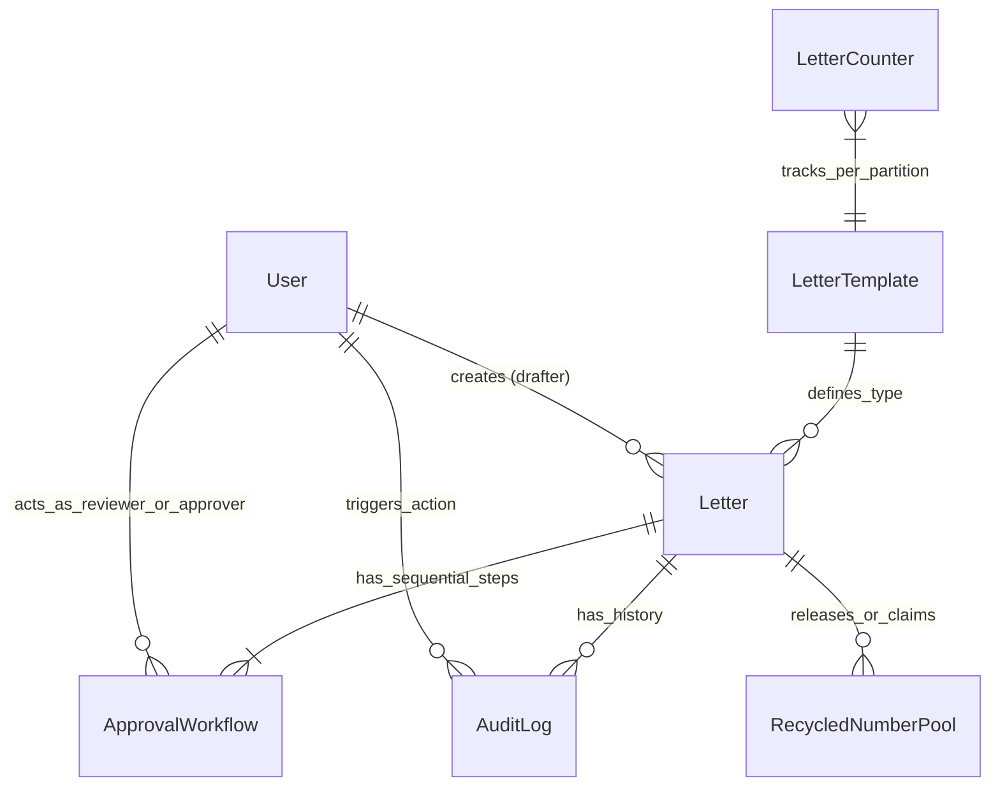
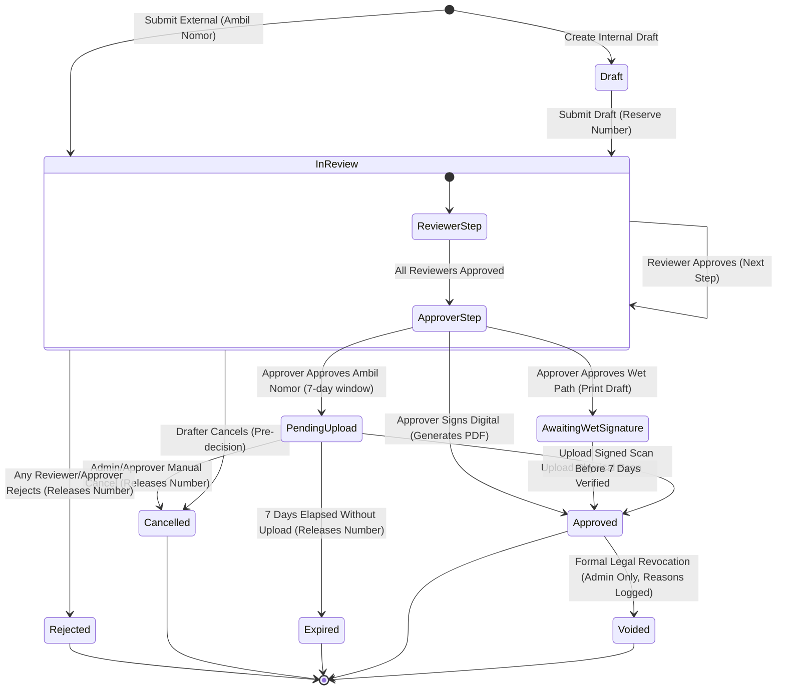

# Data Model: Koneksi Core Laravel Application

**Feature**: [spec.md](file:///Users/ranggarosa/Projects/koneksi-laravel/specs/003-laravel-correspondence-core/spec.md) | **Branch**: `003-laravel-correspondence-core`

This document defines the PostgreSQL database schema, entity relationships, validation rules, and lifecycle state machines for the Koneksi Core application.

---

## 1. Entity Relationship Diagram (ERD)

---

## 2. Table Schemas & Column Definitions

### 2.1 `users`
Represents registered organizational users with assigned RBAC roles.

| Column | Type | Nullable | Default | Description & Constraints |
| :--- | :--- | :---: | :---: | :--- |
| `id` | `BIGSERIAL` | No | PK | Primary Key |
| `name` | `VARCHAR(255)` | No | - | Full formal name |
| `email` | `VARCHAR(255)` | No | - | Official email address (`UNIQUE`) |
| `password` | `VARCHAR(255)` | No | - | Hashed password (`bcrypt`) |
| `role` | `VARCHAR(50)` | No | `'drafter'` | Role enum: `admin`, `drafter`, `reviewer`, `approver` |
| `is_active` | `BOOLEAN` | No | `true` | Account active flag (Principle II whitelist) |
| `signature_image_path`| `VARCHAR(255)` | Yes | `NULL` | Relative storage path for digital signature graphic |
| `remember_token` | `VARCHAR(100)` | Yes | `NULL` | Laravel remember me session token |
| `created_at` | `TIMESTAMP` | Yes | - | Standard timestamp |
| `updated_at` | `TIMESTAMP` | Yes | - | Standard timestamp |

---

### 2.2 `letter_templates`
Defines available official document templates and dynamic schemas.

| Column | Type | Nullable | Default | Description & Constraints |
| :--- | :--- | :---: | :---: | :--- |
| `id` | `BIGSERIAL` | No | PK | Primary Key |
| `code` | `VARCHAR(50)` | No | - | Unique template code (e.g. `SKK`, `SP1`, `SK`, `PKS`) (`UNIQUE`) |
| `name` | `VARCHAR(255)` | No | - | Human-readable title (e.g. Surat Keterangan Kerja) |
| `description` | `TEXT` | Yes | `NULL` | Usage instructions and guidelines |
| `is_external` | `BOOLEAN` | No | `false` | True if template is used for standalone Ambil Nomor |
| `default_tiers` | `JSONB` | Yes | `NULL` | Recommended reviewer/approver tier structure |
| `content_schema` | `JSONB` | Yes | `NULL` | Form field definitions (field name, label, type, required) |
| `is_active` | `BOOLEAN` | No | `true` | Template availability toggle |
| `created_at` | `TIMESTAMP` | Yes | - | Standard timestamp |
| `updated_at` | `TIMESTAMP` | Yes | - | Standard timestamp |

---

### 2.3 `letters`
The central correspondence aggregate storing metadata, numbering, and status.

| Column | Type | Nullable | Default | Description & Constraints |
| :--- | :--- | :---: | :---: | :--- |
| `id` | `BIGSERIAL` | No | PK | Primary Key |
| `template_id` | `BIGINT` | No | - | FK → `letter_templates.id` (`RESTRICT`) |
| `user_id` | `BIGINT` | No | - | FK → `users.id` (Drafter/owner) |
| `type` | `VARCHAR(20)` | No | `'internal'` | Type enum: `internal`, `external` (Ambil Nomor) |
| `reference_number` | `VARCHAR(100)` | Yes | `NULL` | Official formatted number e.g. `0001.SKK/X/2026` (`INDEX`) |
| `sequence_number` | `INTEGER` | Yes | `NULL` | Raw sequential integer value |
| `month_roman` | `VARCHAR(10)` | Yes | `NULL` | Roman numeral month representation (I–XII) |
| `year` | `SMALLINT` | Yes | `NULL` | 4-digit calendar year |
| `letter_date` | `DATE` | No | - | Effective date of letter (strictly non-backdated) |
| `subject` | `VARCHAR(255)` | No | - | Official subject / Perihal surat |
| `recipient` | `VARCHAR(255)` | No | - | Target party / Pihak tujuan surat |
| `content_data` | `JSONB` | Yes | `NULL` | Variable data payload filled by Drafter |
| `signature_type` | `VARCHAR(20)` | Yes | `NULL` | Enum: `digital`, `wet` |
| `status` | `VARCHAR(50)` | No | `'draft'` | Status enum (see Lifecycle States below) |
| `file_path` | `VARCHAR(255)` | Yes | `NULL` | Relative storage path for generated PDF or uploaded scan |
| `reconciliation_deadline`| `TIMESTAMP`| Yes | `NULL` | 7-day expiration window for external Ambil Nomor |
| `created_at` | `TIMESTAMP` | Yes | - | Standard timestamp |
| `updated_at` | `TIMESTAMP` | Yes | - | Standard timestamp |
| `deleted_at` | `TIMESTAMP` | Yes | `NULL` | Soft delete timestamp (hard-deletes strictly banned) |

---

### 2.4 `approval_workflows`
Stores the sequential multi-tier sign-off steps for each letter.

| Column | Type | Nullable | Default | Description & Constraints |
| :--- | :--- | :---: | :---: | :--- |
| `id` | `BIGSERIAL` | No | PK | Primary Key |
| `letter_id` | `BIGINT` | No | - | FK → `letters.id` (`CASCADE`) |
| `step_order` | `SMALLINT` | No | `1` | Sequential step index (1, 2, 3...) |
| `user_id` | `BIGINT` | No | - | FK → `users.id` (Assigned Reviewer or Approver) |
| `role_type` | `VARCHAR(20)` | No | `'reviewer'` | Step classification: `reviewer` or `approver` |
| `status` | `VARCHAR(20)` | No | `'pending'` | Step status: `pending`, `approved`, `rejected` |
| `action_date` | `TIMESTAMP` | Yes | `NULL` | Timestamp when user approved/rejected |
| `notes` | `TEXT` | Yes | `NULL` | Feedback / mandatory revision notes on rejection |
| `created_at` | `TIMESTAMP` | Yes | - | Standard timestamp |
| `updated_at` | `TIMESTAMP` | Yes | - | Standard timestamp |

*Constraint*: `UNIQUE(letter_id, step_order)`

---

### 2.5 `letter_counters`
Manages concurrency-locked atomic integer counters partitioned by month and template.

| Column | Type | Nullable | Default | Description & Constraints |
| :--- | :--- | :---: | :---: | :--- |
| `id` | `BIGSERIAL` | No | PK | Primary Key |
| `template_code` | `VARCHAR(50)` | No | - | Template code partition key |
| `month` | `SMALLINT` | No | - | Calendar month (1–12) |
| `year` | `SMALLINT` | No | - | Calendar year (e.g. 2026) |
| `current_sequence` | `INTEGER` | No | `0` | Latest assigned sequence number |
| `created_at` | `TIMESTAMP` | Yes | - | Standard timestamp |
| `updated_at` | `TIMESTAMP` | Yes | - | Standard timestamp |

*Constraint*: `UNIQUE(template_code, month, year)`

---

### 2.6 `recycled_number_pools`
FIFO pool for reallocating sequence numbers released by rejected or cancelled letters.

| Column | Type | Nullable | Default | Description & Constraints |
| :--- | :--- | :---: | :---: | :--- |
| `id` | `BIGSERIAL` | No | PK | Primary Key |
| `template_code` | `VARCHAR(50)` | No | - | Template partition key |
| `month` | `SMALLINT` | No | - | Calendar month |
| `year` | `SMALLINT` | No | - | Calendar year |
| `sequence_number` | `INTEGER` | No | - | Released sequence number |
| `released_from_letter_id`| `BIGINT` | Yes | `NULL` | FK → `letters.id` (`SET NULL`) |
| `is_claimed` | `BOOLEAN` | No | `false` | Claimed status indicator |
| `claimed_by_letter_id`| `BIGINT` | Yes | `NULL` | FK → `letters.id` (`SET NULL`) |
| `released_at` | `TIMESTAMP` | No | - | Release timestamp |
| `claimed_at` | `TIMESTAMP` | Yes | `NULL` | Re-claim timestamp |
| `created_at` | `TIMESTAMP` | Yes | - | Standard timestamp |
| `updated_at` | `TIMESTAMP` | Yes | - | Standard timestamp |

---

### 2.7 `audit_logs`
Immutable, append-only journal capturing every domain and status transition.

| Column | Type | Nullable | Default | Description & Constraints |
| :--- | :--- | :---: | :---: | :--- |
| `id` | `BIGSERIAL` | No | PK | Primary Key |
| `letter_id` | `BIGINT` | Yes | `NULL` | FK → `letters.id` (`SET NULL`, `INDEX`) |
| `user_id` | `BIGINT` | Yes | `NULL` | FK → `users.id` (`SET NULL`) |
| `actor_email` | `VARCHAR(255)` | No | - | Denormalized actor email at moment of action |
| `action` | `VARCHAR(100)` | No | - | Event type (e.g. `DRAFT_SUBMITTED`, `APPROVED`) |
| `from_status` | `VARCHAR(50)` | Yes | `NULL` | Prior status string |
| `to_status` | `VARCHAR(50)` | Yes | `NULL` | Resulting status string |
| `metadata` | `JSONB` | Yes | `NULL` | Context snapshot (rejection notes, IP, user-agent) |
| `created_at` | `TIMESTAMP` | No | `NOW()` | Timestamp (immutable, no `updated_at`) |

---

## 3. Letter Lifecycle State Machine

---

## 4. Seed Data Baseline

To satisfy FR-002, FR-014, and FR-020, `database/seeders/DatabaseSeeder.php` will provision:

### Users (`users`)
- `admin@koneksi.local` | Role: `admin` | Password: `password`
- `drafter@koneksi.local` | Role: `drafter` | Password: `password`
- `reviewer@koneksi.local` | Role: `reviewer` | Password: `password`
- `approver@koneksi.local` | Role: `approver` | Password: `password`

### Templates (`letter_templates`)
1. **`SKK`** - Surat Keterangan Kerja (Internal, 1-step Approver, Digital Signature)
2. **`SP1`** - Surat Peringatan Pertama (Internal, 2-tier: Reviewer Kabag → Approver Direktur, Digital/Wet)
3. **`SK`** - Surat Keputusan Direksi (Internal, Wet Signature required with scan upload)
4. **`PKS`** - Perjanjian Kerjasama (External / Ambil Nomor, 1-step Approver, 7-day upload window)
